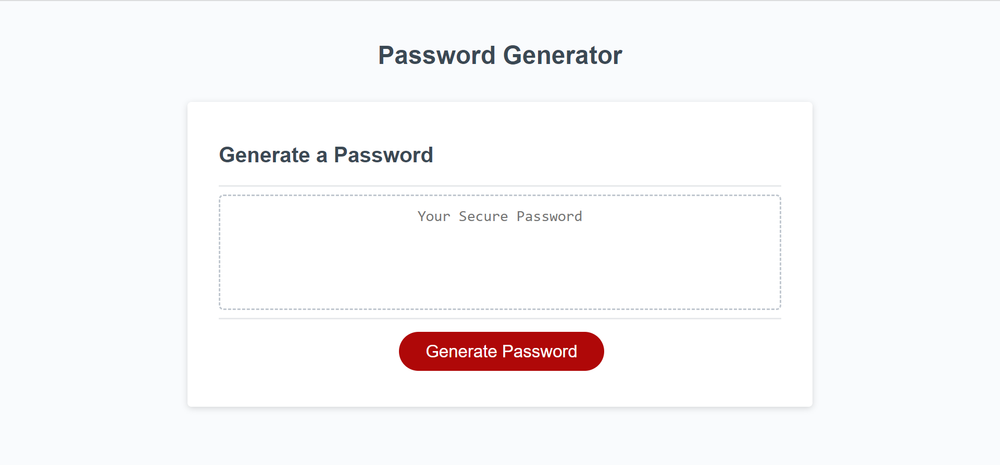
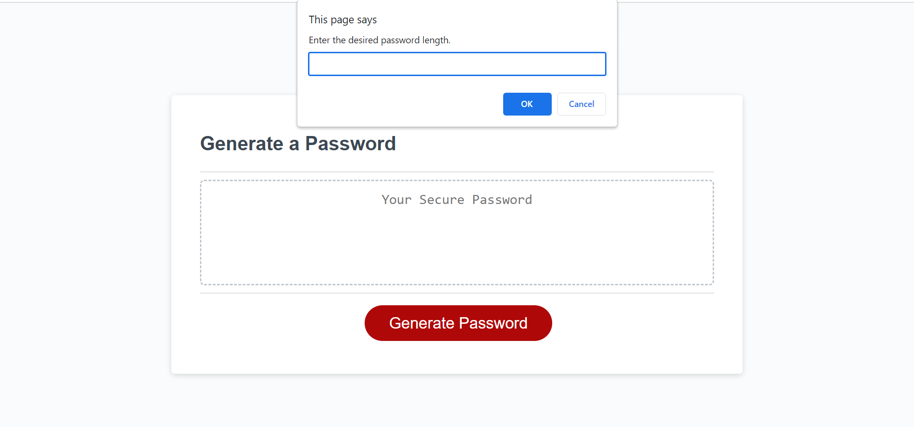
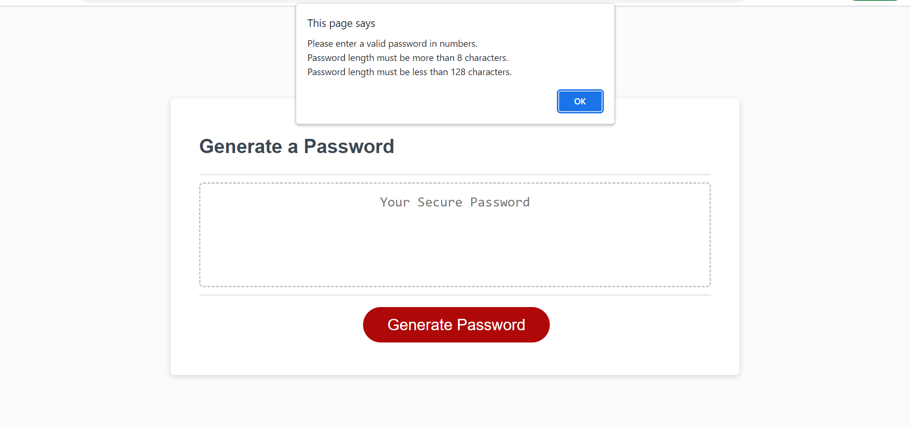
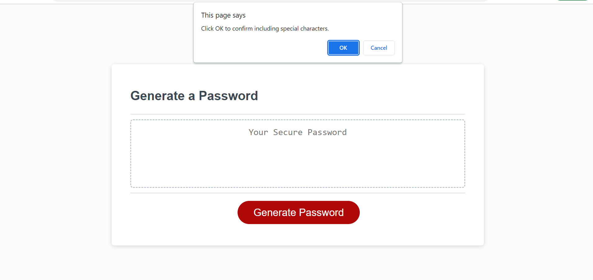
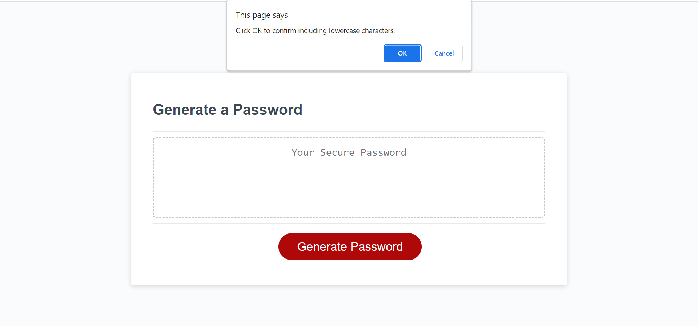
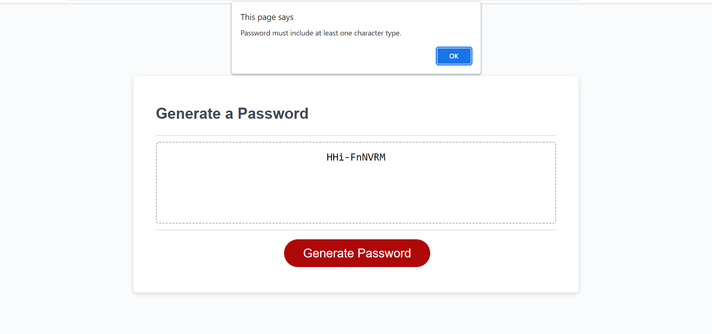

# Title
<Challenge-3_Password-Generator>

## Description 
This is an application that enables employees to generate random passwords based on criteria that they’ve selected. This app will run in the browser and will feature dynamically updated HTML and CSS powered by JavaScript code that you write. It will have a clean and polished, responsive user interface that adapts to multiple screen sizes.

 ## Table of contents.
     prompted series of questions. 
     output box.
     Generate Password button.

 ### Question-1:
 The first question will ask user about their desired password length and it must be not less than 8 characters, not more than 128 characters and must be given in numbers only.
 if these rules weren't met user will get an alert saying
  "Please enter a valid password in numbers.
   Password length must be more than 8 characters.
   Password length must be less than 128 characters."

 ### Question-2:
 The second question will ask user if they want to includ specialCharacters, if they confirm it'll be included if not it'll be ignored.

 ### Question-3:
 The third question will ask user if they want to includ numericCharacters, if they confirm it'll be included if not it'll be ignored.

 ### Question-4:
 The fourth question will ask user if they want to includ lowerCasedCharacters, if they confirm it'll be included if not it'll be ignored.

 ### Question-5:
 The fifth question will ask user if they want to includ upperCasedCharacters, if they confirm it'll be included if not it'll be ignored.

#
At the end user should atleast choose one of the options otherwise if user denied all options an alert will pop-up saying "Password must include at least one character type.".

 ## Usage.
  when clicking on the red 'Generate Password' button you will be asked a series of question to input your selections while those selections must meet our criteria.

 ## Screenshots.

### Deployed Page Link:

https://nabil1294.github.io/Challenge_3/

## Credits.

confirm box
https://sabe.io/blog/javascript-yes-no-confirmation-box#:~:text=Here's%20how%20to%20create%20a,available%20on%20the%20window%20object.

How to Select a Random Element From Array in JavaScript
https://linuxhint.com/select-random-element-from-an-array-javascript/